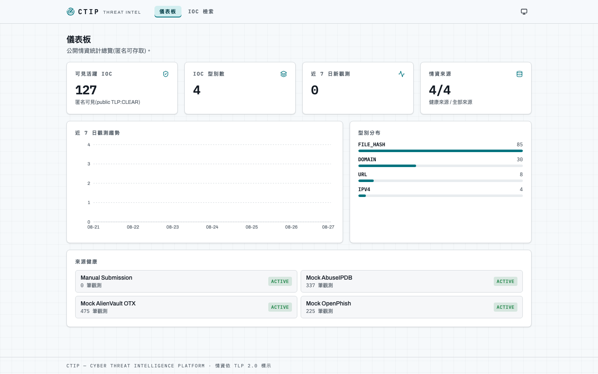

# CTIP — Cyber Threat Intelligence Platform

> **This repository contains a specification and an implementation in progress**
> (currently through Phase 13 of 23 — **milestone M1 (MVP) complete**, M2 in progress: environment, Docker,
> Spring Boot bootstrap, database schema, domain model with minimal security layer,
> ingestion SDK + mock adapters + resilience, ingestion pipeline with data quality and rate
> limiting, dedup/merge/fingerprint/scoring, STIX 2.1 projection & export, the anonymous read
> REST API with cursor pagination and unified error handling, OpenAPI/Swagger documentation
> with a committed, drift-checked openapi.json, full-field PostgreSQL search (GIN/pg_trgm),
> and a React 19 frontend — typed from the OpenAPI contract — with IOC search/detail pages and
> a public statistics dashboard; M2 so far adds authentication, RBAC, JWT with refresh-token
> rotation and reuse detection, API keys, and enforced tenant isolation).
>
> CTIP is a multi-source cyber threat intelligence platform: it ingests indicators of compromise from
> heterogeneous feeds through a plugin adapter architecture, normalizes them into a single domain model,
> deduplicates and merges across sources, and exposes the result over a REST API with STIX 2.1 export and
> Bloom-filter-based incremental sync for lightweight clients.
>
> The specification in [`docs/spec/`](docs/spec/) was **produced with AI assistance and is written to be
> consumed by AI coding agents**. It is designed so that any capable agent can implement the system from it
> independently, and so that two agents reading it at different times produce compatible results.
> Architecture: Domain-Driven Design over Clean/Hexagonal Architecture.

---

## 這是什麼

這個 repository 包含**規格書與進行中的實作**（目前完成 Phase 1–13 —— **里程碑 M1（MVP）完成**、M2 進行中，共 23 個 phase；進度見
[`docs/progress.md`](docs/progress.md)，啟動方式見下方[快速開始](#快速開始目前可跑的部分)）。

規格書位於 [`docs/spec/`](docs/spec/)，它是**用 AI 輔助產生、給 AI 使用**的軟體規格：

```text
GPT 產生初稿（v1.0）
  → Claude 第一輪調整（v1.1，3,038 行單檔）
  → Claude 逐行審查、24 輪設計決策訪談、對 Maven Central / npm / OASIS 等外部來源查證（v2.0）
```

它與一般的「架構文件」不同的地方在於**它被寫成可執行的契約**：

- 每一條 Definition of Done 都對應一個回傳 0/1 的指令（90 項），無法自動化的 6 項被明確標為「需人工確認」
- 每一張圖標註**規範等級**（CI 會擋／人工驗證／僅供參考），因為 ArchUnit 能驗證依賴方向但不能驗證「這個聚合有這個方法」
- 27 張資料表全部有完整欄位定義，避免不同 agent 各自發明 schema
- 附一份中英對照的 Ubiquitous Language 詞彙表，因為規格是中文而程式碼是英文，沒有這張表命名會發散

規格書的導覽與檔案職責見 [`docs/spec/README.md`](docs/spec/README.md)。

---

## 系統摘要

CTIP 的核心能力與所屬里程碑：

| # | 能力 | 里程碑 |
|---|---|---|
| 1 | 從不同 Threat Intelligence Source 收集情資 | M1 |
| 2 | 透過 Adapter / Plugin 架構整合異質來源（第三方可自行擴充） | M1 |
| 3 | 正規化為統一 Domain Model（七種型別各有正規化規則） | M1 |
| 4 | 去重、多來源合併、指紋、威脅評分 | M1 |
| 5 | STIX 2.1 匯出（含 TLP 2.0 marking） | M1 |
| 6 | REST API（cursor 分頁、統一錯誤結構、OpenAPI） | M1 |
| 7 | 多租戶資料隔離 + 匿名唯讀公開情資 | M1（模型與過濾）／M2（完整認證） |
| 8 | TLP 2.0 資料分級與可見度控制 | M1 |
| 9 | 情資再散布政策（法遵：第三方 ToS 與 GDPR） | M1 |
| 10 | 認證、RBAC、API Key | M2 |
| 11 | Free / Premium / Enterprise 方案與配額 | M2 |
| 12 | 使用者提交與匯入 IOC、誤判回報 | M2 |
| 13 | 兩層 Bloom Filter + 增量同步（供 Browser Extension / App） | M2 |
| 14 | Elasticsearch 搜尋（含 ES 故障時降級至 PostgreSQL） | M2 |
| 15 | Kafka 事件、WebSocket / SSE / Webhook 通知 | M3 |
| 16 | Audit Log（append-only）、資料保留政策 | M3 |
| 17 | Prometheus / Grafana / OpenTelemetry 可觀測性 | M3 |

三個里程碑各有獨立的驗收閘門：**M1（Phase 1–12，38 項）→ M2（Phase 13–19，27 項）→ M3（Phase 20–23，25 項）**。
未通過前一個閘門不得開始下一個里程碑。

### 明確不做的事

不自建所有第三方情資來源、不做 ML 威脅偵測、不做完整 SIEM / SOAR、不做 Kubernetes-first 部署、不做多區域 active-active、不串接真實金流、不做 TAXII 2.1 Server（僅保留擴充點）。不採用 CQRS 與 Event Sourcing。

---

## 模組功能摘要

### 後端 Maven Module（4 個）

| Module | 對外提供 | 允許依賴 | Phase | 治理規格 |
|---|---|---|---|---|
| `ctip-sdk` | **Shared Kernel**：`ThreatSourceAdapter` 契約、跨界列舉（`IocType`／`Tlp`／`Severity`／`RedistributionPolicy` 等）。可獨立發布至 Maven Central | JDK、`jakarta.validation-api`。**零 Spring** | 1, 5 | [01 §1.3](docs/spec/01-architecture.md#13-maven-multi-module)、[02 §2.5](docs/spec/02-ddd-model.md#25-shared-kernelctip-sdk) |
| `ctip-core` | `domain`（9 個聚合 + 不變量）+ `application`（service + out-port） | `ctip-sdk`、spring-context、spring-tx。**無 JPA、無 spring-data** | 4, 6–8 | [01](docs/spec/01-architecture.md)、[02](docs/spec/02-ddd-model.md) |
| `ctip-adapters` | 內建與 mock 的 Threat Source Adapter 實作 | `ctip-sdk`、HTTP client、Resilience4j。**不依賴 `ctip-core`** | 5, 14 | [08 §8.1、§8.3](docs/spec/08-ingestion-sdk.md) |
| `ctip-app` | Spring Boot 啟動類、`infrastructure`、`interfaces`、Flyway、設定檔。唯一產生可執行 jar 者 | 全部 | 3, 9–10, 13+ | [01 §1.4](docs/spec/01-architecture.md#14-package-結構)、[05](docs/spec/05-environment.md) |

### 後端 Domain 模組（`ctip-core/domain/*`）

| 模組 | 對外提供 | 允許依賴 | Phase | 治理規格 |
|---|---|---|---|---|
| `indicator` | `Indicator` 聚合根（14 條不變量）、`IndicatorSource`、`HashRecord`、`IndicatorMergePolicy`、正規化器 | sdk、`shared` | 4, 6, 7 | [07 §7.1–§7.5](docs/spec/07-domain-intel.md) |
| `source` | `Source` 聚合根、`SourceHealth` 狀態機、`Reputation` | sdk、`shared` | 4, 5 | [08 §8.6](docs/spec/08-ingestion-sdk.md#86-來源健康) |
| `tenant` | `Tenant` 聚合根、`TenantSlug`、public tenant 常數 | sdk、`shared` | 4 | [10 §10.1](docs/spec/10-identity-plans.md#101-多租戶) |
| `fingerprint` | `FingerprintStrategy`、`Sha256FingerprintStrategy`、`Fingerprint` | sdk | 7 | [07 §7.4](docs/spec/07-domain-intel.md#74-去重與指紋) |
| `stix` | STIX 物件模型與 builder、`StixTlpMarkings`、`StixPatternBuilder` | sdk、`indicator`、`threat` | 8, 18 | [07 §7.8](docs/spec/07-domain-intel.md#78-stix-21-映射) |
| `event` | `DomainEvent` 型別 + 19 個具體事件 | sdk、`shared` | 4+ | [02 §2.4](docs/spec/02-ddd-model.md#24-domain-event-清單) |
| `shared` | `Cursor`、`CursorPage`、共用型別 | sdk | 4 | [02 §2.6](docs/spec/02-ddd-model.md#26-值物件清單) |
| `identity` | `User` 聚合根（7 條）、`RefreshToken`、`ApiKey` 聚合根（7 條） | sdk、`tenant`、`shared` | 13 | [10 §10.3–§10.5](docs/spec/10-identity-plans.md) |
| `subscription` | `Subscription` 聚合根（5 條）、`BillingPeriod` | sdk、`tenant`、`shared` | 14 | [10 §10.6](docs/spec/10-identity-plans.md#106-方案) |
| `bloom` | `BloomVersion` 聚合根（8 條）、`BloomArtifact`、`BloomParameters`、`Checksum` | sdk、`tenant`、`fingerprint` | 15 | [11](docs/spec/11-sync-bloom.md) |
| `threat` | `Threat` 聚合根（6 條）、`ThreatIndicatorLink`、`ExternalReference` | sdk、`indicator`、`shared` | 18 | [02](docs/spec/02-ddd-model.md#threat)、[04](docs/spec/04-data-dictionary.md) |
| `notification` | `Webhook` 聚合根（6 條）、`WebhookFilter` | sdk、`tenant`、`event` | 20 | [13 §13.2](docs/spec/13-platform-ops.md#132-通知-phase-20--m3) |

`application` 之下的模組（`ingestion`、`search`、`sync`、`audit` 等）為對應的 service 層，out-port 集中於 `application/port`。

### 前端 Feature（`frontend/src/features/*`）

**feature 之間不得直接 import**（ESLint `import/no-restricted-paths` 強制）。共用內容上移至 `components/` 或 `hooks/`。

| Feature | 對外提供 | 允許依賴 | Phase | 治理規格 |
|---|---|---|---|---|
| `ioc` | IOC 搜尋／詳情／提交／匯入的元件與 hook | `api/`、`components/`、`hooks/`、`utils/` | 12, 14 | [12 §12.5](docs/spec/12-frontend.md#125-頁面) |
| `stix` | STIX JSON 檢視、關聯圖（M3 用 Cytoscape.js） | 同上 | 12, 20 | [12 §12.6](docs/spec/12-frontend.md#126-ui-要求) |
| `auth` | 登入／註冊／token 刷新／路由守衛 | 同上 + `stores/authSlice` | 13 | [12](docs/spec/12-frontend.md) |
| `sync` | Bloom 說明頁與同步狀態 | 同上 | 16 | [11 §11.7](docs/spec/11-sync-bloom.md#117-client-契約摘要必須複製進-sdk-與-api-文件) |
| `subscription` | 方案與用量檢視 | 同上 | 14 | [10 §10.6](docs/spec/10-identity-plans.md#106-方案) |
| `apikey` | API key 建立／撤銷（原文只顯示一次） | 同上 | 13 | [10 §10.5](docs/spec/10-identity-plans.md#105-api-key-phase-13--m2) |
| `threat` | Threat feed 與詳情 | 同上 | 18 | [12 §12.5](docs/spec/12-frontend.md#125-頁面) |
| `notification` | 通知中心、WebSocket 連線狀態 | 同上 + `stores/toastSlice` | 20 | [13 §13.2](docs/spec/13-platform-ops.md#132-通知-phase-20--m3) |
| `audit` | 稽核紀錄檢視 | 同上 | 21 | [13 §13.5](docs/spec/13-platform-ops.md#135-稽核-phase-21--m3) |

### 基礎設施

| 服務 | 用途 | 啟動於哪個 profile |
|---|---|---|
| PostgreSQL 18 | **唯一的 source of truth** | 全部 |
| Redis 8 / Valkey 9 | 快取 + 分散式限流 | `standard`、`full` |
| Elasticsearch 9.5 / OpenSearch 3 | 讀取索引（可隨時由 DB 重建） | `full` |
| Kafka 4.2（KRaft） | Domain event 傳輸 | `full` |
| Nginx 1.30（stable） | 前端靜態服務 + 安全標頭 | 全部（production build） |
| Prometheus / Grafana | 監控 | `full` |

`SearchPort` 與 `CachePort` 的抽象讓 Elasticsearch → OpenSearch、Redis → Valkey 的替換只需改 infrastructure 實作與 image 名稱（授權與支援窗口考量見 [06 §6.5](docs/spec/06-tech-stack.md#65-授權注意事項)）。

---

## 如何使用這份規格

**如果你是 AI agent**：從 [`docs/spec/README.md`](docs/spec/README.md) 開始，它會告訴你讀取順序。不要一次讀完全部檔案。

**如果你是人類**：先讀上面的系統摘要與模組表，再讀 [`docs/spec/00-master.md`](docs/spec/00-master.md) 的 §0.6 變更摘要（那裡列出 v1.1 的 4 項建置阻斷缺陷、3 項版本錯誤、10 項內部衝突及其解法），以及 **§0.7–§0.14 實作回饋修訂**（Phase 2–13 實測與 M1 總複查發現的規格衝突與修正索引；照字面實作會踩的坑集中在 [05 §5.8.1](docs/spec/05-environment.md#581-實作回饋修正2026-08-21phase-23-實測發現詳見-adr-0001) 與 [06 §6.3.6](docs/spec/06-tech-stack.md#636-spring-boot-4-模組化與-testcontainers-2x編譯地雷)）。

---

## 現況

| 項目 | 狀態 |
|---|---|
| 規格書 | ✅ v2.0 完成（含 2026-08-21 / 2026-08-25 / 2026-08-26 / 2026-08-27 / 2026-08-28 十一輪實作回饋修訂，見 [00 §0.7–§0.17](docs/spec/00-master.md)） |
| `environment/` | ✅ Phase 2 完成：唯一 compose 檔、雙 Dockerfile、四環境樣板、8 支腳本（含 90 項 DoD gate 的 `dod.sh`）、CI compose 驗證。`migrate.sh` 於 2026-08-28 修好——它從 Phase 2 起就呼叫 `flyway:migrate`，但專案從未加過 flyway-maven-plugin（[ADR 0014](docs/architecture/decisions/0014-flyway-monotonic-versions.md)）。Phase 13 修正樣板 `JWT_SECRET`——原值 `CHANGE_ME_MIN_32_BYTES` 自己只有 22 bytes，HS256 上線後會讓照樣板複製的全新環境啟動失敗 |
| `backend/` | ✅ **M1（Phase 1–12）完成**：四模組骨架與 Spring Boot 4 啟動、Flyway V1–V7 + 1,020 筆種子資料、Indicator/Tenant/Source 聚合與最小安全層（tenant + TLP + 再散布統一過濾）、SDK + 三個確定性 mock adapter + Resilience4j 韌性、10-stage ingestion pipeline（正規化、八種拒絕規則、去重合併、評分、STIX 投影）、排程與記憶體限流、STIX 2.1 匯出（TLP 2.0 marking、pattern、bundle）、匿名讀取 REST API 全套（IOC 清單／明細／搜尋／批次驗證、統計、來源、cursor 分頁、16 錯誤碼統一錯誤結構 + traceId）、OpenAPI/Swagger（springdoc 3.1.0、逐端點完整性測試、`docs/api/openapi.json` 產出 + CI drift／破壞性變更檢查）、PostgresSearchAdapter 全欄位搜尋（tags GIN `@>`、來源、confidence/score/時間區間、pg_trgm 子字串）與 CORS 接線（262 tests，Testcontainers 整合驗證）<br>🟡 **M2 進行中（Phase 13 完成）**：Flyway V20/V21/V24（users、roles、permissions、role_permissions、tenant_users、refresh_tokens、api_keys + RBAC 種子）、User／ApiKey 聚合（U1–U7、K1–K7 逐條測試）、JWT HS256 + refresh token 輪替與重用偵測（family 全撤）、BCrypt cost 12 與登入鎖定、API key（原文僅回一次、前綴定位、scope 不可提權）、Spring Security filter chain + `@PreAuthorize` + 集中 PermissionEvaluator、跨租戶一律 404（參數化涵蓋每個端點）、安全測試 1–9 全綠。**Phase 13 收尾稽核**（逐端點對照 §10.3 矩陣 + 架構 / 資安複查，[ADR 0013](docs/architecture/decisions/0013-phase13-audit-fixes.md)）再補 12 項修正：`/sources`／`/stats` 五個端點原本完全沒有授權宣告（filter chain 是 `permitAll`，等於全開）→ 新增 `source:read`／`stats:read`（權限 19 → 21、矩陣 95 → 105 格）並以 `EndpointAuthorizationTest` 逐 handler 守門；停權與移除成員資格對 refresh／API key 原本完全無效 → `AccountAccessPolicy` fail-closed;refresh token family 90 天絕對上限;登入鎖定訊息不再洩漏帳號存在;密碼上限對齊 BCrypt 72 bytes;API key 數量上限;`last_used_at` 改定向 UPDATE（避免沖掉撤銷）。另**先行清掉後續 phase 的已知缺口**（[ADR 0015](docs/architecture/decisions/0015-future-phase-hardening.md)）：`/stats/sources` 筆數補可見度過濾與 `sourceId` 查詢參數的來源歸屬 oracle（兩者都是 Phase 14 手動提交上線後才會真正洩漏）、限流 bucket 逐出、STIX name 截斷不切 surrogate pair、filter 逸出例外也回統一錯誤結構（**537 tests**） |
| `frontend/` | ✅ **M1（Phase 11–12）完成**：React 19 + Vite 8 + Tailwind CSS v4（CSS-first）、OpenAPI 型別產生鏈（`api:generate`/`api:check`，手寫 typed fetch client）、Redux Toolkit 四 slice + TanStack Query（狀態歸屬依規格：server 資料進 Query、搜尋條件進 URL）、shadcn 風格元件 + 四態 StateViews + TlpBadge + TanStack Virtual 虛擬化表格、IOC 檢索／詳情（含來源歸屬與 STIX JSON）與公開統計儀表板（Recharts）、深色模式與響應式、MSW 型別驅動測試（70 tests，coverage ≥ 70% 門檻實測 90%+）<br>🟡 **M2 進行中（Phase 13 完成）**：登入／註冊頁、API Key 管理頁（原文一次性顯示）、路由層 `RequireAuth`／`RequirePermission` 掛載、401 自動輪替 refresh token（並行請求共用單次輪替）、header 登入／登出與身分顯示;API key 可授予的 scope 補上 `source:read`／`stats:read`（97 tests） |
| 進度與交接 | [`docs/progress.md`](docs/progress.md)（逐 phase 判準結果、偏離事項、給下一 session 的注意事項） |
| 架構決策 | [`docs/architecture/decisions/`](docs/architecture/decisions/)（ADR 0001–0015：各 phase 的規格衝突處置、實作決策、環境維護、M1 總複查、Phase 13 認證層決策與其收尾稽核修正、Flyway 版本號策略、後續 phase 缺口的先行清理） |

實作進行中，本檔會隨里程碑**擴充**——M2/M3 再補寫入 API 與方案配額、Bloom 增量同步、部署與維運等段落。
**既有段落（這是什麼／系統摘要／模組功能摘要）不得被覆寫。**

---

## 快速開始（目前可跑的部分）

需求：Docker ≥ 27（Compose ≥ 2.24）。首次啟動會自動預熱容器內的 Maven 與 npm 快取（需數分鐘）。

```bash
[ -f environment/.env.mvp ] || cp environment/.env.mvp.example environment/.env.mvp
./environment/scripts/up.sh mvp
curl -fsS http://localhost:8080/actuator/health
```

啟動後（mvp = frontend + backend + postgres 三個容器，全部只綁 `127.0.0.1`）：

| 服務 | 位置 |
|---|---|
| Backend health | <http://127.0.0.1:8080/actuator/health> |
| Frontend（Vite dev） | <http://127.0.0.1:5173> |
| PostgreSQL | `127.0.0.1:5432`（帳密見 `environment/.env.mvp`；啟動時自動跑 Flyway V1–V7 + V20/V21/V24 並載入約 1,020 筆樣本 IOC） |
| REST API（Phase 9 起） | `GET /api/v1/iocs?limit=10`、`GET /api/v1/stats/summary`、`GET /api/v1/sources`、`POST /api/v1/iocs/lookup`（匿名可讀 public TLP:CLEAR 情資；cursor 分頁、統一錯誤結構） |
| 認證與 API Key（Phase 13 起） | `POST /api/v1/auth/{register,login,refresh,logout}`（匿名可存取，登入回 access + refresh token）、`GET/POST /api/v1/api-keys`、`DELETE /api/v1/api-keys/{id}`（需 `apikey:create` / `apikey:revoke`；機器對機器改帶 `X-API-Key: ctip_<env>_<32 碼>`） |
| Swagger UI（Phase 10 起） | <http://127.0.0.1:8080/swagger-ui/index.html>（OpenAPI JSON：<http://127.0.0.1:8080/v3/api-docs>；`SWAGGER_ENABLED` 控制，prod 預設關） |
| 前端 UI（Phase 11–13 起） | <http://127.0.0.1:5173>（儀表板 `/`、IOC 檢索 `/iocs`、IOC 詳情 `/iocs/:id`：匿名可用；登入 `/login`、註冊 `/register`、API Key 管理 `/settings/api-keys`：需登入與 `apikey:create`；深色模式） |
| STIX 2.1（Phase 8 起） | `GET /api/v1/stix/{stixId}`，例：<http://127.0.0.1:8080/api/v1/stix/marking-definition--94868c89-83c2-464b-929b-a1a8aa3c8487>（TLP:CLEAR marking；indicator 投影於來源同步後產生） |

後端測試（L1–L3，整合測試用 Testcontainers 自帶 PostgreSQL，不需先啟動環境）：

```bash
./backend/mvnw -f backend/pom.xml verify -Ptest-integration
```

停止環境用 `./environment/scripts/down.sh mvp`；後端改了 Java 檔用
`./environment/scripts/reload.sh backend mvp` 熱替換；其餘腳本見
[`environment/README.md`](environment/README.md)。

### 疑難排解：backend 沒回應（Swagger / API 打不開，容器卻顯示 Up）

dev 容器與 host **共享 `backend/*/target/classes`**（bind mount）。此問題**已於 ADR 0010 根治**：
DevTools 的 restart 改由 trigger file 觸發（`reload.sh` 編譯成功後 touch
`backend/ctip-app/.devtools/.reloadtrigger`），host 上跑 `mvnw verify`／`clean` 不再引發
容器內熱重啟，也就不會再撞上「半寫入」的 classpath 使 application context 死亡。

若仍遇到 backend 無回應（`curl http://localhost:8080/actuator/health` 空回應、
`docker ps` 卻顯示 Up），restart 即恢復：

<!-- 此區塊刻意用 sh 而非 bash:dod.sh M1-38 會執行 README 的全部 bash 區塊,疑難排解指令不應被閘門盲跑 -->
```sh
docker compose --env-file environment/.env.mvp -f environment/docker-compose.yml restart backend
```

`dod.sh` 的 M1-14／M1-33 也內建同款自我修復（縱深防禦,ADR 0009／0010）。

---

## Demo(畫面速覽)

M1 的四個主要畫面——儀表板、IOC 檢索、IOC 詳情、Swagger UI——的截圖與說明見
[`docs/demo/`](docs/demo/README.md)(匿名唯讀,只呈現 public TLP:CLEAR 情資)。

[](docs/demo/README.md)

---

## 授權與安全

- 授權：見 `LICENSE`（實作階段建立）
- 安全政策與漏洞回報：見 `SECURITY.md`（實作階段建立）
- 第三方元件授權說明（Redis / Elasticsearch 的 copyleft 考量與替代方案）：`docs/deployment/licensing.md`（M3 Phase 23 產出；規格要求見 [06 §6.5](docs/spec/06-tech-stack.md#65-授權注意事項)）
- 個資與資料保留：`docs/deployment/privacy.md`（M3 Phase 23 產出；規格要求見 [13 §13.4](docs/spec/13-platform-ops.md#134-隱私與資料保留)）

⚠️ 本平台處理的 IP 位址在 GDPR 下**可能構成個人資料**。規格已納入資料保留政策、資料主體查詢與刪除程序，以及情資再散布的法遵限制（多數商業情資來源的 ToS 禁止再散布原始資料）。詳見 [07 §7.9](docs/spec/07-domain-intel.md#79-再散布政策法遵強制) 與 [13 §13.4](docs/spec/13-platform-ops.md#134-隱私與資料保留)。
