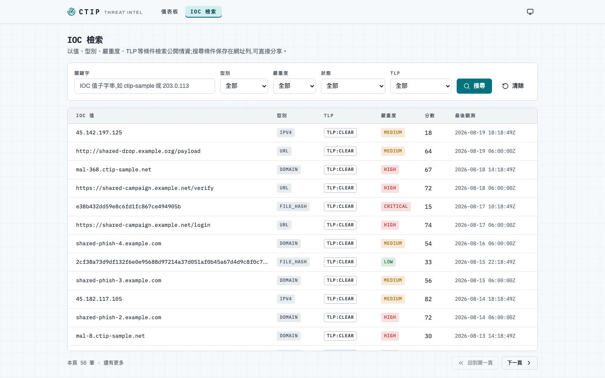
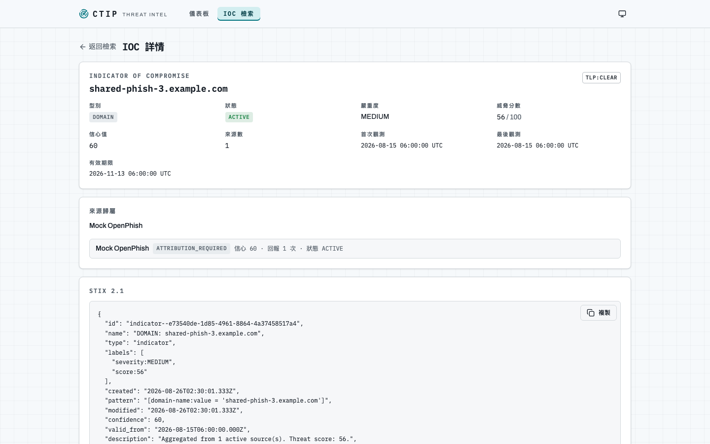
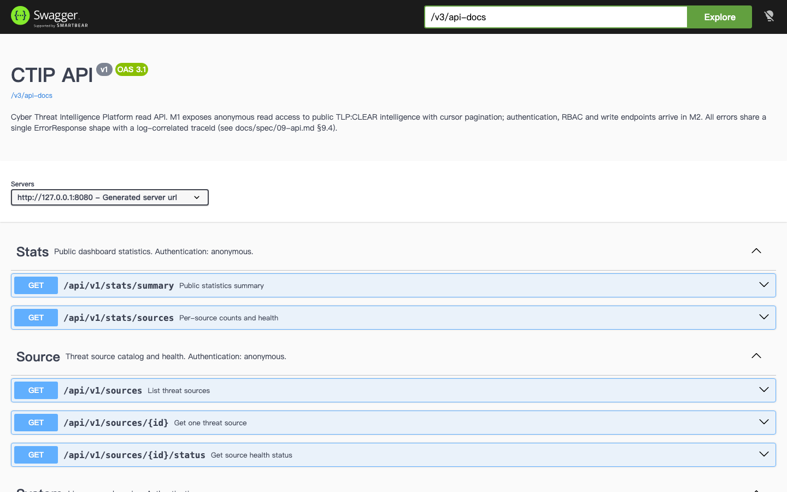

# CTIP Demo — M1(MVP)畫面速覽

以下截圖取自本機 `./environment/scripts/up.sh mvp` 啟動的環境(2026-08-27,M1 完成時點)。
M1 為**匿名唯讀**:所有頁面不需登入,只呈現 public 租戶 TLP:CLEAR 的情資
(TLP 可見度與再散布過濾規則見 `docs/spec/07-domain-intel.md` §7.7/§7.9)。

要自己跑起來:見 [root README](../../README.md) 的「快速開始」段。

---

## 儀表板(`/`)

公開統計總覽:可見活躍 IOC 數、型別分布、近 7 日觀測趨勢(UTC 日期)、四個情資來源的健康狀態。
資料來自 `GET /api/v1/stats/summary` 與 `/api/v1/stats/sources`,圖表為 Recharts。

## IOC 檢索(`/iocs`)

以關鍵字(pg_trgm 子字串)、型別、嚴重度、狀態、TLP 檢索;搜尋條件保存在網址列可直接分享,
表格為 TanStack Virtual 虛擬化 + keyset cursor 分頁(固定 `lastSeen DESC, id DESC`)。

## IOC 詳情(`/iocs/:id`)

單筆 IOC 的合併結果(多來源加權信心值、威脅分數、有效期限)、來源歸屬
(ATTRIBUTION_REQUIRED 來源必須標示;INTERNAL_ONLY/DERIVED_ONLY 依政策遮罩),
以及 STIX 2.1 indicator 投影原文(可複製)。

## Swagger UI(`/swagger-ui/index.html`)

springdoc 產生的 OpenAPI 3.1 文件,逐端點含 summary、response schema 與範例;
`docs/api/openapi.json` 為 committed 產物,CI 會擋 drift 與破壞性變更。
(`SWAGGER_ENABLED` 控制,prod 預設關閉。)

