# CTIP 功能速覽 — 畫面與端點

本檔是「跑起來之後看得到什麼」的導覽，涵蓋三個里程碑。
啟動方式見 [root README](../../README.md) 的「快速開始」；
開發環境細節見 [`../development/getting-started.md`](../development/getting-started.md)。

**兩種身分**：

- **匿名** —— 不需登入，只看得到 public 租戶的 `TLP:CLEAR` 情資
  （可見度與再散布過濾規則見 [07 §7.7／§7.9](../spec/07-domain-intel.md)）
- **登入後** —— 自助註冊即得 `TENANT_ADMIN`，可看到自己租戶的私有情資與管理功能；
  能做多少事由**方案配額**決定（[10 §10.6](../spec/10-identity-plans.md#106-方案)）

> **截圖怎麼來的**（誠實標示，因為有兩處不是預設狀態）：M1 四張取自 2026-08-27，
> 其餘 11 張於 2026-08-30 補拍，皆來自本機 `./environment/scripts/up.sh mvp` 的環境。
>
> 1. 登入後的畫面用一個示範租戶，並**手動指派** `ENTERPRISE` 方案與 `SYSTEM_ADMIN` 角色——
>    自助註冊得到的是 `TENANT_ADMIN` + `FREE`，而 `/notifications` 需要方案的 `websocket_enabled`
>    （FREE 為 `false`）、`/admin` 需要 `system:admin`。
> 2. 威脅情報的四筆資料是補拍時經 `POST /threats` 建立的——種子資料只有 IOC，
>    **Threat 只能由寫入端點產生**（那五個端點正是 Phase 18 補上的，理由見 [`../history.md`](../history.md)）。

---

## M1 — 匿名唯讀

`./environment/scripts/up.sh mvp` 即可，三個容器（frontend + backend + postgres），
啟動時自動載入約 1,020 筆樣本 IOC。

### 儀表板（`/`）

公開統計總覽：可見活躍 IOC 數、型別分布、近 7 日觀測趨勢（UTC 日期）、四個情資來源的健康狀態。
資料來自 `GET /api/v1/stats/summary` 與 `/api/v1/stats/sources`，圖表為 Recharts。


### IOC 檢索（`/iocs`）

以關鍵字（pg_trgm 子字串）、型別、嚴重度、狀態、TLP 檢索；搜尋條件保存在網址列可直接分享，
表格為 TanStack Virtual 虛擬化 + keyset cursor 分頁（固定 `lastSeen DESC, id DESC`）。


### IOC 詳情（`/iocs/:id`）

單筆 IOC 的合併結果（多來源加權信心值、威脅分數、有效期限）、來源歸屬
（`ATTRIBUTION_REQUIRED` 來源必須標示；`INTERNAL_ONLY`／`DERIVED_ONLY` 依政策遮罩），
以及 STIX 2.1 indicator 投影原文（可複製）。


### Swagger UI（`/swagger-ui/index.html`）

springdoc 產生的 OpenAPI 3.1 文件，逐端點含 summary、response schema 與範例；
`docs/api/openapi.json` 為 committed 產物，CI 會擋 drift 與破壞性變更。
（`SWAGGER_ENABLED` 控制，prod 預設關閉。）


---

## M2 — 身分、方案、同步

### 威脅情報（`/threats`、`/threats/:id`）· 匿名可用

清單走 cursor 分頁與 URL 篩選；詳情呈現摘要、別名、外部參照、關聯 IOC 與 STIX 投影
（只有 `MALWARE_FAMILY` 與 `ATTACK_PATTERN` 有 SDO，其餘型別不顯示該區塊，
而不是顯示一個永遠 404 的面板）。

⚠️ 關聯清單比 `indicatorCount` 短時，頁面會**明說差額** —— 那是 TLP 或再散布政策擋掉的；
靜默留白會讓使用者以為情資不見了。

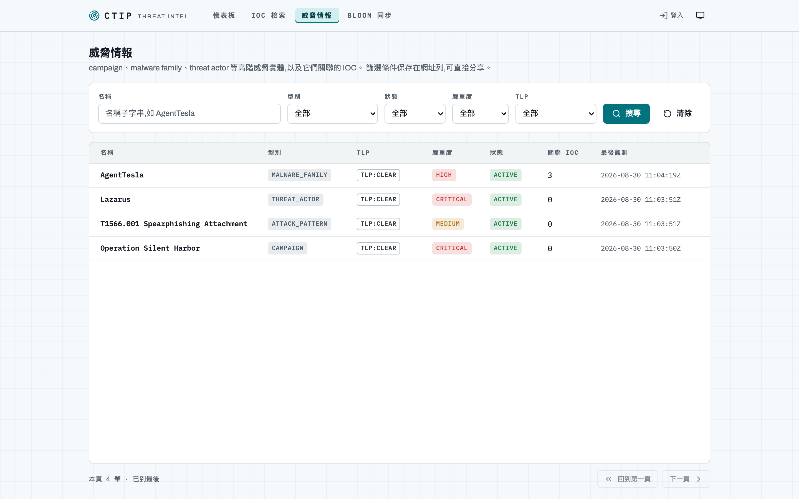

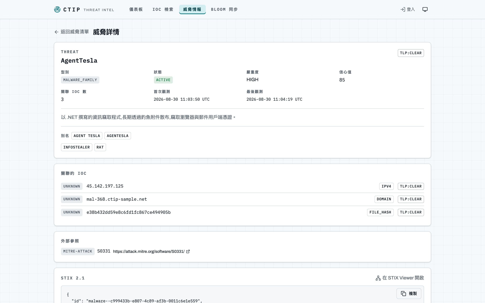

### Bloom 同步說明頁（`/sync`）· 匿名可用

兩層 Bloom 的 manifest（含「完全同步後應有的 checksum」）與 [§11.6](../spec/11-sync-bloom.md) 的同步步驟。
頁面明文寫著三件事，因為它們是這個功能最容易被誤用的地方：

- **命中不代表確定惡意**，**未命中不代表安全**
- `TLP:GREEN` **完全沒有覆蓋**
- 撤銷與過期**只有 full snapshot 會反映**

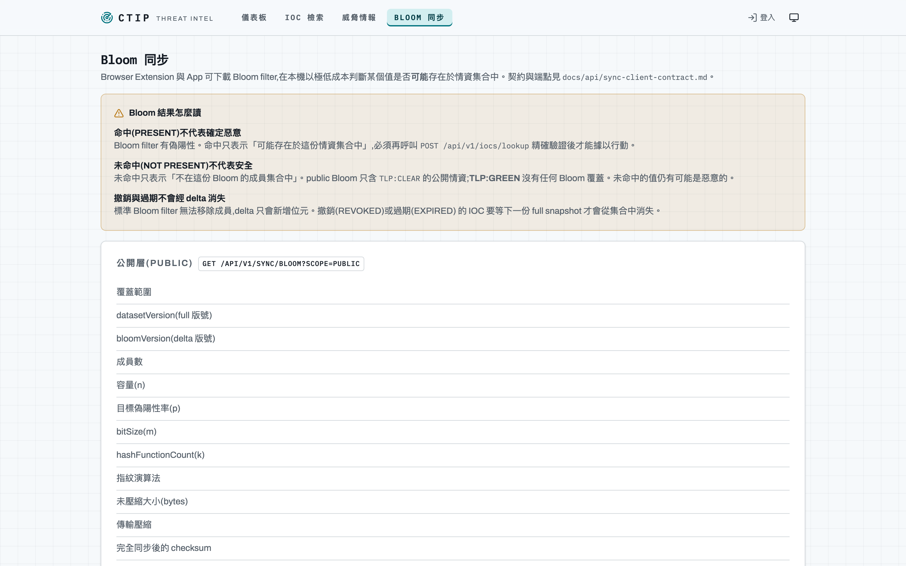

### 登入／註冊、API Key、方案用量、設定

| 頁面 | 路徑 | 需要 |
|---|---|---|
| 登入／註冊 | `/login`、`/register` | 匿名 |
| 設定 | `/settings` | 登入 |
| API Key 管理 | `/settings/api-keys` | `apikey:create` |
| 方案與用量 | `/settings/subscription` | `subscription:read` |
| IOC 提交／匯入 | `/iocs/new`、`/iocs/import` | `ioc:submit`／`ioc:import`（PREMIUM 以上） |

API key 原文**只在建立當下顯示一次**；方案用量頁把 `null`（無限制）與 `0`（停用）
分開呈現，兩者不得都印成 0。設定頁的變更密碼送出成功後**全部裝置登出**（含目前這一個）——
後端撤銷的是該使用者的全部 token family。

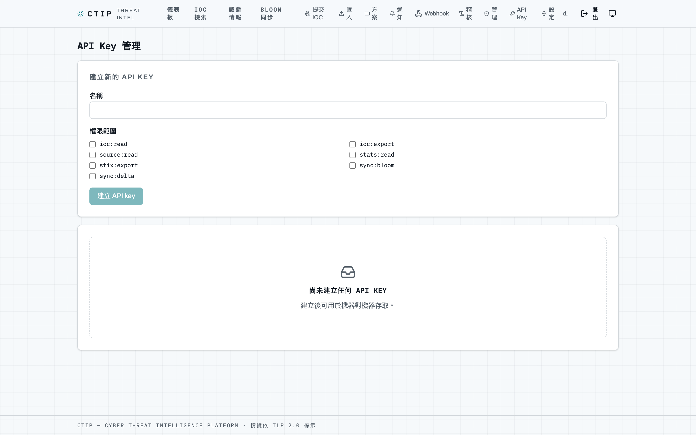

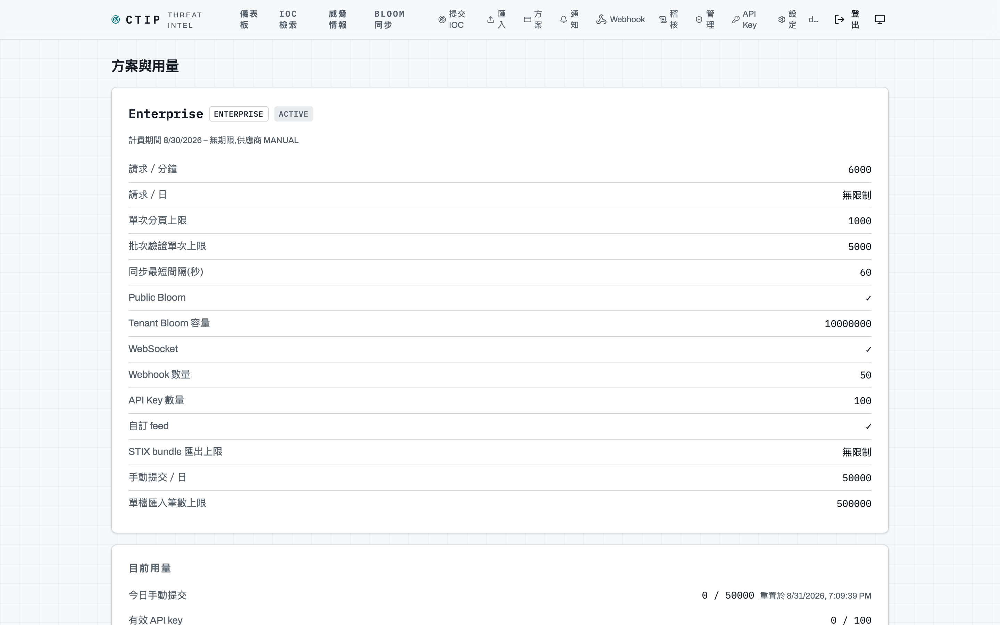

上圖是 `ENTERPRISE`：「請求 / 日」印的是**無限制**（`null`）而不是 0，「Public Bloom」「WebSocket」「自訂 feed」是布林能力，其餘是數值上限——
§10.6 的 14 個維度全在這一頁，而且**全部讀 `plans` 表**（Phase 14 把 property 版本連同五個環境變數一併移除，避免第二真相來源）。

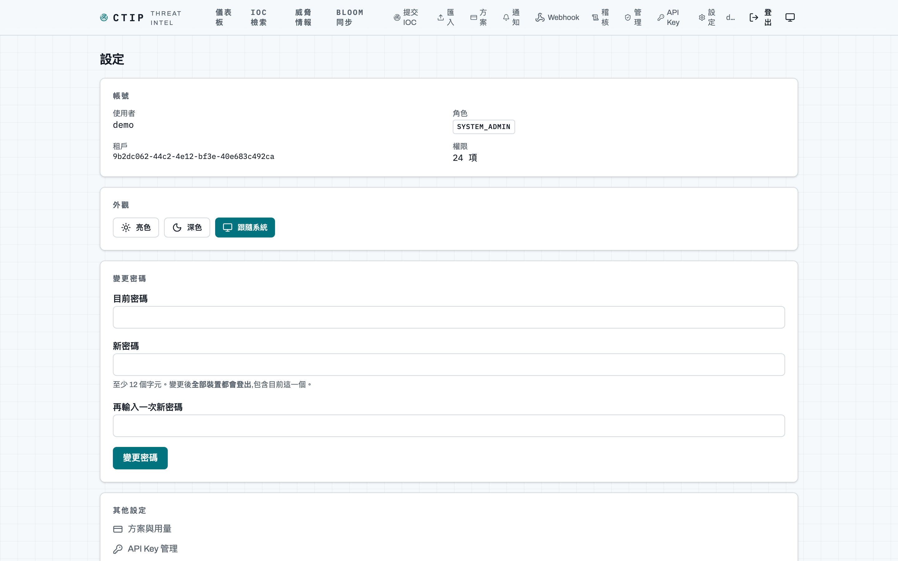

---

## M3 — 營運面

| 頁面 | 路徑 | 需要 |
|---|---|---|
| STIX Viewer | `/stix/:id` | 匿名 |
| 通知中心 | `/notifications` | `notification:read` |
| Webhook 管理 | `/settings/webhooks` | `webhook:manage`（PREMIUM 以上） |
| 稽核軌跡 | `/audit` | `audit:read`（TENANT_ADMIN 以上） |
| 平台管理 | `/admin` | `system:admin` |

**STIX Viewer** 以 Cytoscape.js 畫關聯圖（SRO 畫成邊而不是節點），支援節點展開與型別篩選，
並附原始 JSON。入口在 IOC 詳情與威脅詳情的 STIX 面板。
⚠️ 圖只能**順著物件自身的參照往外長** —— 平台沒有「哪些 relationship 指向我」的反查端點，
這一點寫在 UI 上而不是用假資料掩蓋。

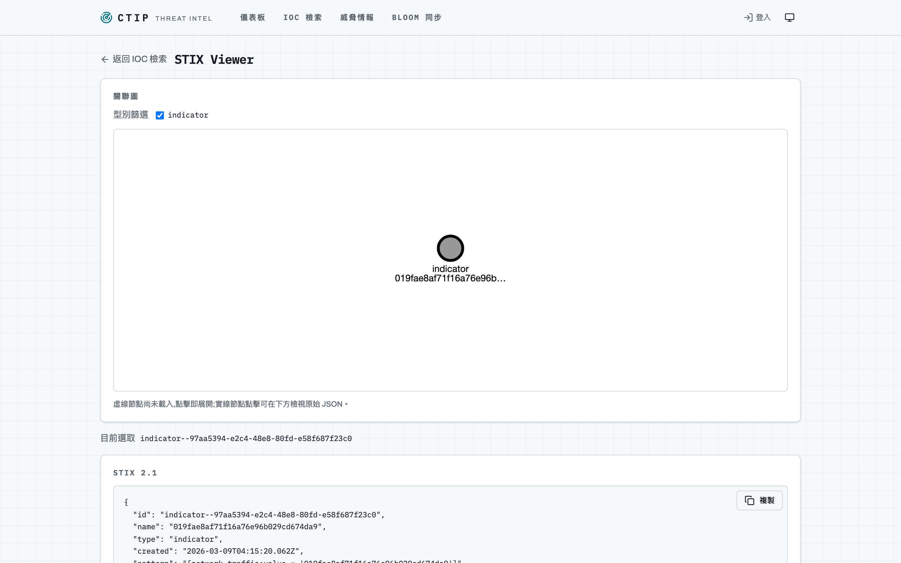

**通知中心**的即時推送走原生 WebSocket，指數退避 **+ 抖動**自動重連；
連線狀態指示器會誠實說出「連線中斷，重試中」。推播只是「有新東西了」的訊號，
清單仍以 TanStack Query 為真相來源，所以漏掉的推播會在下一次 refetch 補上。

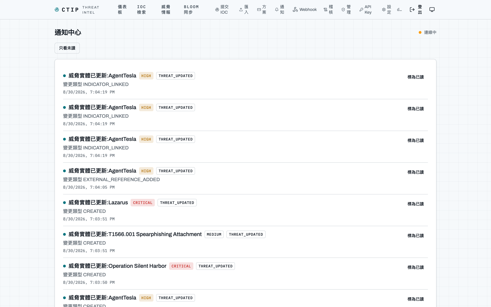

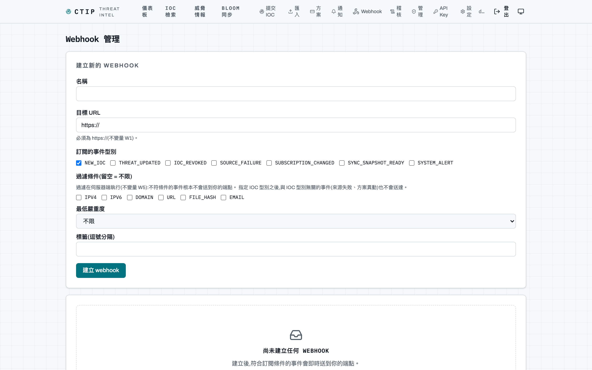

**稽核軌跡頁只讀** —— 軌跡是 append-only 的，沒有刪除與編輯（應用角色在 DB 層連 `DELETE` 權限都沒有）。
**平台管理頁**的資料主體刪除，回應會**明說仍保留幾列稽核紀錄**，
否則操作者會以為「刪除」把一切都刪了。

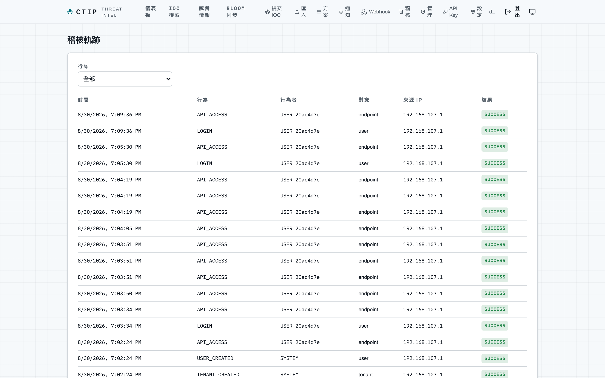

上圖的內容全部來自補拍當下的操作：`TENANT_CREATED` / `USER_CREATED`（註冊）、`LOGIN`，
以及每一次請求的 `API_ACCESS` —— **寫入 100%、讀取取樣 1%**（`AUDIT_SAMPLE_READ_RATE`）。

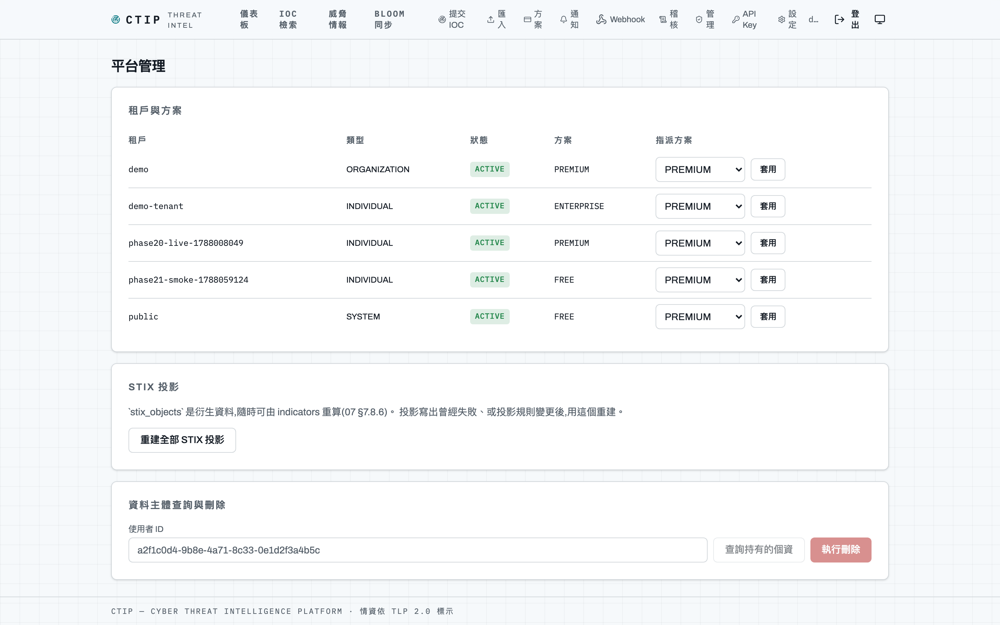

---

## 端點速查

完整契約以 [`../api/openapi.json`](../api/openapi.json) 為準（54 個端點）；下表是能立刻打的幾個。

### 匿名可用

```sh
curl -s 'http://127.0.0.1:8080/api/v1/iocs?limit=10'
curl -s  http://127.0.0.1:8080/api/v1/stats/summary
curl -s  http://127.0.0.1:8080/api/v1/sources
curl -s -X POST http://127.0.0.1:8080/api/v1/iocs/lookup \
     -H 'Content-Type: application/json' -d '{"values":["1.2.3.4"]}'
curl -s  http://127.0.0.1:8080/api/v1/stix/marking-definition--94868c89-83c2-464b-929b-a1a8aa3c8487
curl -s  http://127.0.0.1:8080/api/v1/sync/manifest
```

### 登入之後

```sh
curl -s -X POST http://127.0.0.1:8080/api/v1/auth/register \
     -H 'Content-Type: application/json' \
     -d '{"email":"you@example.com","password":"<12–72 bytes>","tenantName":"Demo","tenantSlug":"demo"}'
# 登入回 access + refresh token;之後帶 Authorization: Bearer <access>
# 機器對機器改用 API key:X-API-Key: ctip_<env>_<32 碼>
```

### 各功能的入口與注意事項

| 功能 | 端點 | 注意 |
|---|---|---|
| 搜尋 | `POST /api/v1/iocs/search` | 回應必帶 `X-Search-Backend: elasticsearch\|postgres`。mvp 是 postgres（pg_trgm 子字串），staging／prod 是 elasticsearch；**ES 不可用時自動降級並仍回 200**。`{"fuzzy":true}` 的 typosquatting 比對**僅 ES 後端有效** |
| 增量同步 | `GET /sync/manifest`、`/sync/bloom?scope=PUBLIC`、`/sync/delta?base=0` | manifest 與 bloom 匿名可用（`sync:bloom`）；delta 需登入（`sync:delta`）。**Bloom 由排程產生**（full 每日 04:00、delta 每小時），剛啟動時尚無 snapshot，manifest 的 `public` 會缺席。client 契約見 [`../api/sync-client-contract.md`](../api/sync-client-contract.md) |
| 限流 | 每個回應 | 都帶 `X-RateLimit-Limit`／`-Remaining`／`-Reset`（無上限的方案印字面值 `unlimited`）；超限回 `429` + `Retry-After`。反向代理後方需設 `TRUSTED_PROXIES`，見 [`../deployment/rate-limiting.md`](../deployment/rate-limiting.md) |
| 寫入 | `POST /iocs`、`POST /iocs/import`、`GET /iocs/import/{jobId}`、`POST /iocs/{id}/report-false-positive` | 提交走**完整 ingestion pipeline**，預設 `TLP:AMBER`、歸屬不可指定；匯入回 `202` + jobId 非同步處理 |
| 即時通知 | `GET /api/v1/ws`、`GET /api/v1/events` | WebSocket 的 token 走 `Sec-WebSocket-Protocol: ctip.auth.<jwt>`（**不接受 query string**）；SSE 是 fallback。**兩者都需要方案的 `websocket_enabled`** |
| Webhook | `POST /api/v1/webhooks` | 簽章密鑰只在建立當下回傳一次。接收端契約（五個標頭、`HMAC-SHA256(secret, timestamp + "." + body)`、5 分鐘時鐘偏差、重試與連續五次後停用）見 [`../api/webhooks.md`](../api/webhooks.md) |
| 稽核與管理 | `GET /audit-logs`、`/api/v1/admin/**` | 稽核只回自己租戶的軌跡且 append-only；管理端點含租戶總覽與方案指派、來源手動同步、STIX 重建、資料主體查詢／刪除 |
| 監控 | `GET /actuator/prometheus` | **只在 staging／prod 暴露**，且受 `PROMETHEUS_ALLOWED_IPS` 白名單限制；mvp／dev 只有 `health`／`info`。`up.sh staging` 會一併啟動 Prometheus 與 Grafana |

### 兩件跨環境的行為差異

- **日誌格式由 profile 決定**：mvp／dev 為單行純文字，staging／prod 為 JSON（九個必含欄位，憑證一律遮罩）
- **追蹤**：傳入的 W3C `traceparent` 會被延續，`traceId` 同時出現在錯誤回應與日誌；
  有 OTLP collector 時設 `TRACING_EXPORT_ENABLED=true`

---

## 資料保留（背景進行，看不到畫面但會動）

六項清理排程，由 `SCHEDULER_ENABLED` 總開關控制：稽核 180 天、raw payload／拒絕記錄／
送達記錄 30 天、`EXPIRED` indicator 1 年後**軟**刪除、Bloom artifact 保留 30 份。
稽核與四項清理走**專用 DB 角色** `ctip_retention` —— 應用角色對 `audit_logs` 連 `DELETE` 權限都沒有。
個資處理、保留期與資料主體程序見 [`../deployment/privacy.md`](../deployment/privacy.md)。
