# 03 — 關聯圖（前端 · 後端）

> **每張圖標註規範等級。** 三個等級的差別在於**可否機械驗證**：
>
> | 等級 | 意義 | 驗證方式 |
> |---|---|---|
> | 🔴 **規範·自動驗證** | 必須符合，CI 會擋 | ArchUnit / ESLint / migration 比對 |
> | 🟡 **規範·人工驗證** | 必須符合，但工具無法檢查 | Code review／AI 自查，偏離須寫 ADR |
> | ⚪ **參考** | 協助理解，不構成約束 | 無 |
>
> 不做這個區分的話，未來任何合理重構都會被記為「違反規格」，規格就會開始被忽略——這是規格腐化最常見的起點。
>
> 格式一律 **Mermaid**（純文字可 diff、GitHub 原生渲染、AI 可讀可寫）。**不使用圖片。**

---

## 3.1 後端模組依賴圖

> 🔴 **規範·自動驗證**

由 [01-architecture.md](01-architecture.md#19-archunit-規則強制共-11-條) 的 ArchUnit 規則 1–5、8 驗證。

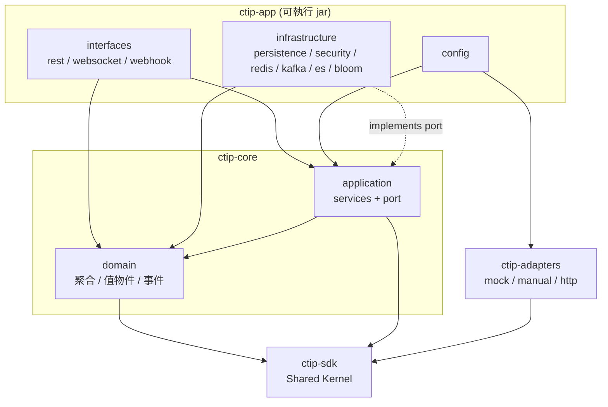

**禁止的邊（ArchUnit 會擋）**

| 禁止 | 規則 |
|---|---|
| `domain` → Spring / JPA / Jackson / Kafka / Redis / ES | 1 |
| `ctip-sdk` → Spring / JPA | 2 |
| `interfaces` → `infrastructure.persistence` | 3 |
| `interfaces.rest` → `application.port.*Repository` | 4 |
| 任何循環 | 5 |
| `application` → `org.springframework.data.domain` | 8 |
| `ctip-adapters` → `ctip-core` | pom 層強制（`ctip-adapters` 的 pom 不含 `ctip-core` 相依） |

---

## 3.2 聚合圖

九張。**每張圖必須畫出方法，不只欄位**——只畫欄位的類別圖是 [04-data-dictionary.md](04-data-dictionary.md) 的重複表述，而且會教出 anemic domain model。

### 3.2.1 Indicator 聚合

> 🟡 **規範·人工驗證**

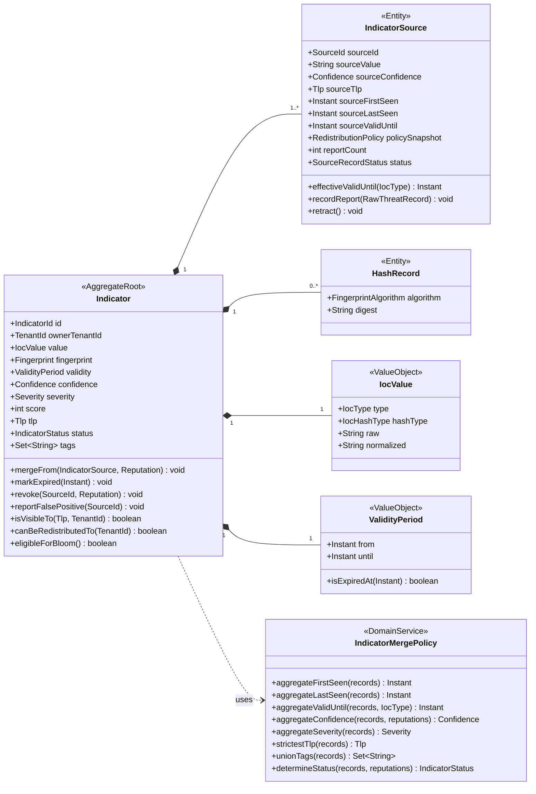

**不變量 I1–I14 見 [02-ddd-model.md](02-ddd-model.md#indicator)。**
`IndicatorMergePolicy` 為無狀態純函式，以參數接收 `Reputation`——**不持有 repository**。

---

### 3.2.2 Source 聚合

> 🟡 **規範·人工驗證**

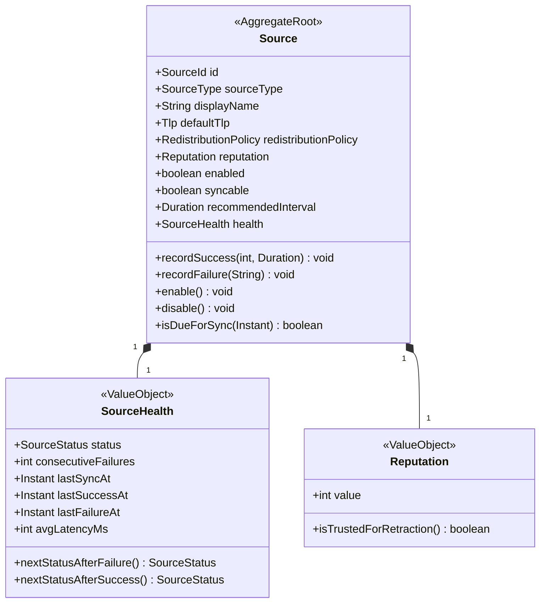

狀態機 S2–S4 見 [02-ddd-model.md](02-ddd-model.md#source)。`isTrustedForRetraction()` 即 `value >= 80`。

---

### 3.2.3 Tenant 聚合

> 🟡 **規範·人工驗證**

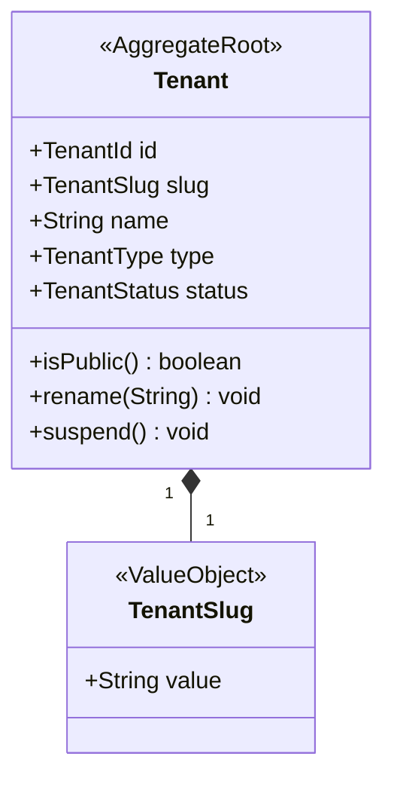

`isPublic()` 即 `id == 00000000-0000-0000-0000-000000000000`。`rename` 與 `suspend` 對 public tenant 皆拒絕（T2）。

---

### 3.2.4 User 聚合 `[M2]`

> 🟡 **規範·人工驗證**

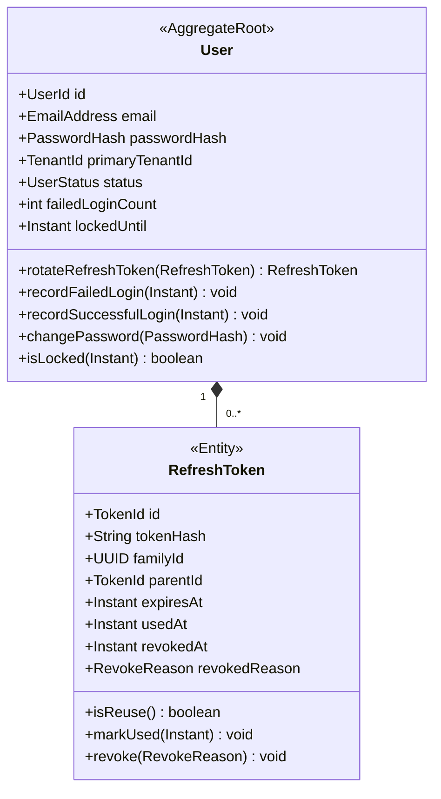

`rotateRefreshToken` 執行 U4–U6：若 `presented.isReuse()` 則撤銷整個 `familyId` 並發出 `TokenReuseDetected`。

---

### 3.2.5 ApiKey 聚合 `[M2]`

> 🟡 **規範·人工驗證**

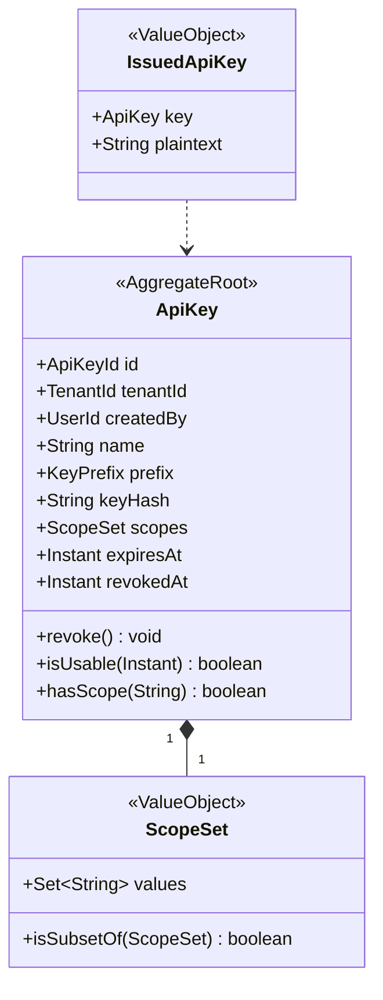

`IssuedApiKey` 只在建立當下存在，`plaintext` 永不持久化（K1）。

---

### 3.2.6 Subscription 聚合 `[M2]`

> 🟡 **規範·人工驗證**

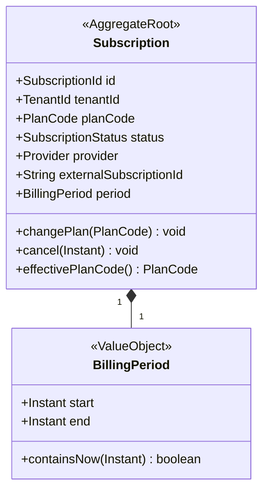

> `Plan` 本身是**參考資料**（兩模型，無 domain model）。`Subscription` 以 `PlanCode` 值物件參照，不持有 `Plan` 物件。
> ⚠️ `Plan` **沒有** TLP 相關欄位——TLP 與方案完全解耦。

---

### 3.2.7 Threat 聚合 `[M2]`

> 🟡 **規範·人工驗證**

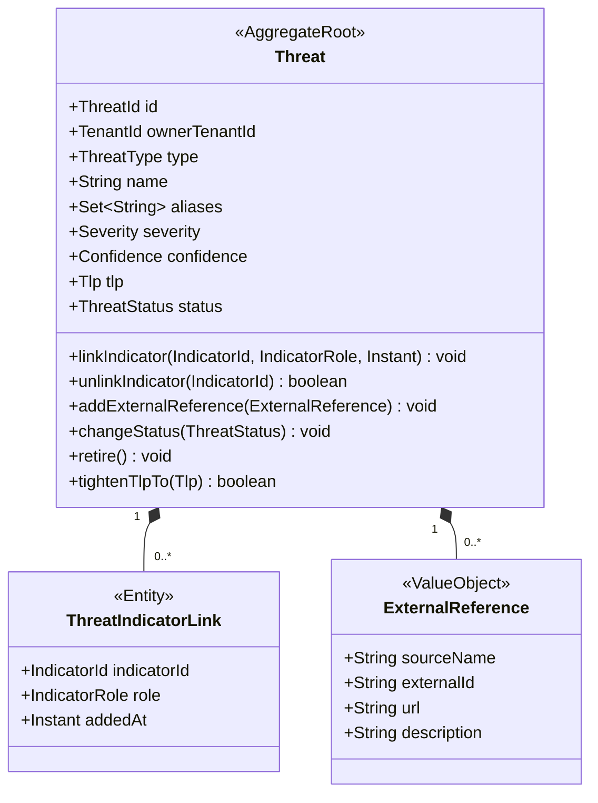

**H5**：`ThreatIndicatorLink` 只存 `IndicatorId`，**不持有 `Indicator` 物件**——跨聚合只能以 ID 參照。

> **2026-08-29(Phase 18;[ADR 0027](../architecture/decisions/0027-phase18-threat-and-m2-stix.md))**:
> `changeStatus` 讓 `ThreatStatus.DORMANT` 可達(只有 `retire()` 的話它是永不可達的列舉值);
> `tightenTlpTo` 是 H6 降格為應用層規則後的執行點(單向收緊)。
> `linkIndicator` 的時間由 application 以 `ClockPort` 傳入(規則 23:domain 不得讀時鐘)。

---

### 3.2.8 BloomVersion 聚合 `[M2]`

> 🟡 **規範·人工驗證**

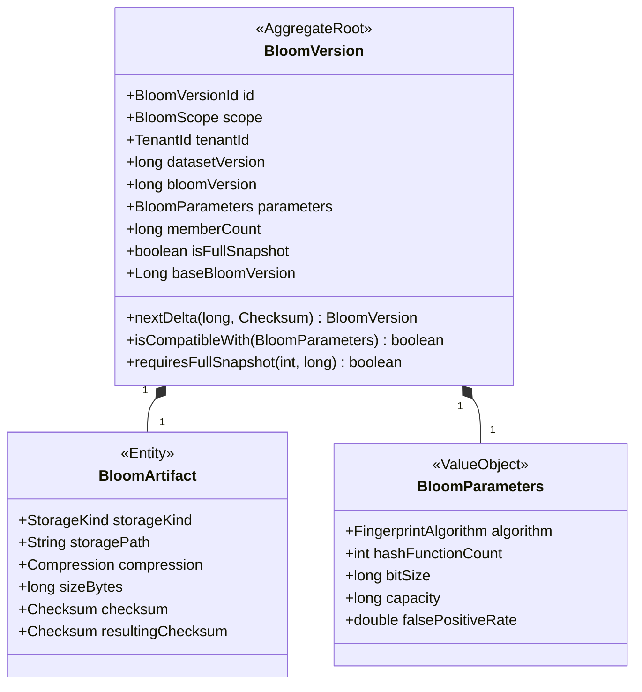

**L7／L8** 見 [02-ddd-model.md](02-ddd-model.md#bloomversion)：public Bloom 只含 `CLEAR`；`GREEN` **無 Bloom 覆蓋**；命中永不代表確定惡意。

---

### 3.2.9 Webhook 聚合 `[M3]`

> 🟡 **規範·人工驗證**

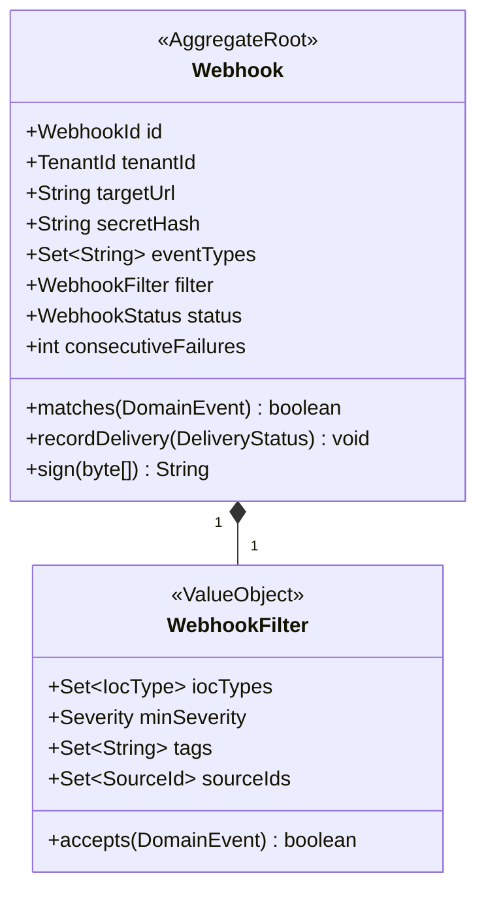

**W5**：`matches()` 在伺服器端執行，不得把全部事件推給 client 再過濾。

> **簽章的輸入型別(2026-08-29,Phase 20;[ADR 0029](../architecture/decisions/0029-phase20-kafka-and-notifications.md) 第 1 節)**:
> 圖中的 `matches(DomainEvent)` / `accepts(DomainEvent)` 實際為 **`NotificationEvent`**
> ——[02 §2.4](02-ddd-model.md#24-domain-event-清單) 的 domain event 身上沒有
> `WebhookFilter` 需要的 `severity` / `tags` / `sourceIds`(它們是多來源合併之後才定的),
> 而 [13 §13.1](13-platform-ops.md#131-事件與-kafka-phase-20--m3) 明文「不修改任何發佈端」。
> `NotificationEvent` 是 domain event 的通知形狀投影,由 application 層在送出前從聚合補齊。
> **W5 不變**:過濾仍完全在伺服器端。

---

## 3.3 ERD

> 🔴 **規範·自動驗證**

由 CI 比對 Flyway migration 產生的實際 schema 與 [04-data-dictionary.md](04-data-dictionary.md)。
本圖**取代 v1.1 的 §61 ERD CONCEPT**（該節與 §18.1、§36.1 互相矛盾，已刪除）。

```mermaid
erDiagram
    TENANTS ||--o{ INDICATORS : owns
    TENANTS ||--o{ USERS : has
    TENANTS ||--o{ TENANT_USERS : membership
    TENANTS ||--o{ API_KEYS : has
    TENANTS ||--o| SUBSCRIPTIONS : has
    TENANTS ||--o{ THREATS : owns
    TENANTS ||--o{ BLOOM_VERSIONS : has
    TENANTS ||--o{ WEBHOOKS : has
    TENANTS ||--o{ AUDIT_LOGS : scoped

    USERS ||--o{ TENANT_USERS : joins
    USERS ||--o{ REFRESH_TOKENS : holds
    USERS ||--o{ API_KEYS : created
    ROLES ||--o{ TENANT_USERS : grants
    ROLES ||--o{ ROLE_PERMISSIONS : has
    PERMISSIONS ||--o{ ROLE_PERMISSIONS : granted
    PLANS ||--o{ SUBSCRIPTIONS : defines

    SOURCES ||--o{ SOURCE_SYNC : logs
    SOURCES ||--o{ INDICATOR_SOURCES : reports
    SOURCES ||--o{ INGESTION_REJECTIONS : rejected
    SOURCES ||--o{ HASH_RECORDS : produced

    INDICATORS ||--|{ INDICATOR_SOURCES : "aggregated from"
    INDICATORS ||--o{ HASH_RECORDS : fingerprints
    INDICATORS ||--o{ STIX_OBJECTS : projected
    INDICATORS ||--o{ THREAT_INDICATORS : linked

    THREATS ||--o{ THREAT_INDICATORS : links
    THREATS ||--o{ THREAT_EXTERNAL_REFERENCES : cites
    THREATS ||--o{ STIX_OBJECTS : projected

    BLOOM_VERSIONS ||--|| BLOOM_ARTIFACTS : stores
    WEBHOOKS ||--o{ WEBHOOK_DELIVERIES : attempts
    SOURCE_SYNC ||--o{ INGESTION_REJECTIONS : during

    TENANTS ||--o{ NOTIFICATIONS : scoped
    USERS ||--o{ NOTIFICATIONS : receives
    STIX_OBJECTS ||..o{ STIX_RELATIONSHIPS : "linked via stix_id"
```

**全部 27 張表皆已畫入。** 虛線關聯（`..`）表示非 FK 的弱參照——`stix_relationships.source_ref` / `target_ref` 存的是 STIX ID 字串而非 UUID 外鍵，因此 DB 層無 FK 約束。

---

## 3.4 Ingestion 協作圖

> ⚪ **參考**

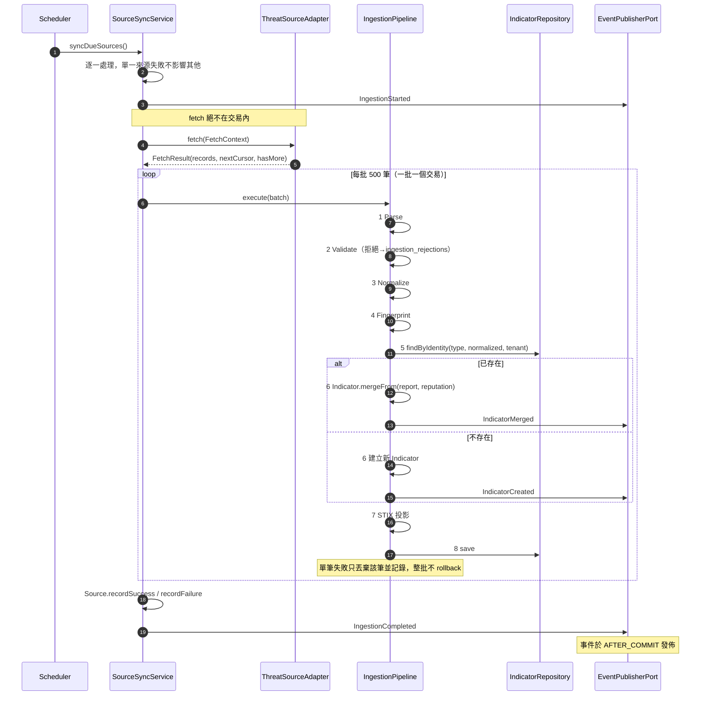

M2 起在 8 之後加 Bloom 更新與 ES 索引；M3 起 `EventPublisherPort` 額外轉發至 Kafka。**發佈端程式碼不修改。**

---

## 3.5 前端圖

> ⚠️ **前端沒有「類別關聯圖」。** React 19 + function component + hooks 的技術棧沒有 class。以下四張圖提供類別圖在 OO 程式庫中提供的價值（誰可以引用誰），並補上類別圖無法表達但本專案關鍵的**狀態歸屬**。
> 產出 class component 視為規格違規。

### 3.5.1 Feature 依賴圖

> 🔴 **規範·自動驗證**

由 ESLint `import/no-restricted-paths` 驗證。

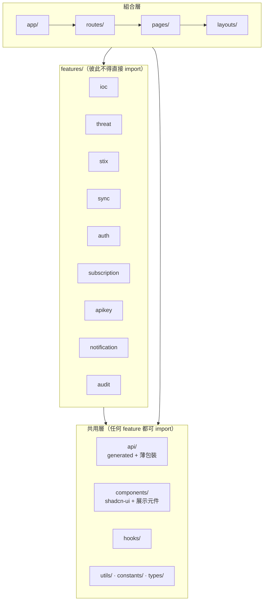

**強制規則**

| # | 規則 | ESLint 設定 |
|---|---|---|
| F1 | `features/A` 不得 import `features/B/**` 的任何檔案 | `import/no-restricted-paths` zones |
| F2 | `components/`、`hooks/`、`utils/` 不得 import `features/**` | 同上 |
| F3 | `api/generated/**` 不得被手改 | CI 比對 OpenAPI 產物 |
| F4 | 只有 `pages/`、`routes/`、`app/` 可跨多個 feature | 同上 |

共用內容一律上移到 `components/` 或 `hooks/`，**不得**在 feature 之間橫向引用。

---

### 3.5.2 狀態歸屬圖

> 🟡 **規範·人工驗證**

**這張表是規範性的。** v1.1 只有一句「不得把 server 資料塞進 Redux」，完全不可稽核。

```mermaid
flowchart LR
    subgraph server["TanStack Query（server state）"]
        Q1["iocList / iocDetail"]
        Q2["threatList / threatDetail"]
        Q3["sourceList / sourceStatus"]
        Q4["stixObject / stixBundle"]
        Q5["syncManifest"]
        Q6["subscription / usage"]
        Q7["apiKeyList"]
        Q8["notificationList"]
        Q9["auditLogList"]
        Q10["dashboardStats"]
    end
    subgraph client["Redux Toolkit（client state）"]
        R1["authSlice<br/>token / 使用者身分 / 權限"]
        R2["uiSlice<br/>主題 / 表格欄位設定 / 側欄折疊"]
        R3["toastSlice<br/>全域通知佇列"]
        R4["filterDraftSlice<br/>尚未送出的搜尋條件"]
    end
    subgraph url["URL（單一真相）"]
        U1["搜尋條件 / cursor / 排序"]
    end
    server -.->|唯讀| client
    url --> server
```

| 資料 | 歸屬 | 禁止 |
|---|---|---|
| 任何來自 API 的實體資料 | **TanStack Query** | 放入 Redux |
| 已送出的搜尋條件、cursor、排序 | **URL search params** | 放入 Redux 或 Query |
| 尚未送出的表單草稿 | Redux `filterDraftSlice` 或 RHF 本地狀態 | 放入 Query |
| access token、使用者身分、權限集合 | Redux `authSlice` | 放入 Query（會被快取失效清掉） |
| 主題、表格欄位設定 | Redux `uiSlice` + localStorage | — |
| toast 佇列 | Redux `toastSlice` | — |
| WebSocket 推來的即時事件 | 寫入 **Query cache**（`setQueryData`）或 `toastSlice` | 建立第三套 store |

判準：**「重新整理頁面後應該重新取得的，屬 Query；應該保留的，屬 Redux 或 URL。」**

---

### 3.5.3 型別流向圖

> 🔴 **規範·自動驗證**

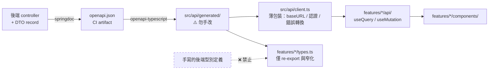

- 後端 OpenAPI 規格是**唯一**的型別來源
- `src/api/generated/` 進版控但標記勿手改
- CI 驗證：重新產生的型別與 committed 版本一致，不一致則 fail
- `features/*/types.ts` 只能 re-export 或窄化 generated 型別，**不得重新定義**後端型別

---

### 3.5.4 元件樹（代表性頁面）

> ⚪ **參考**

`IOC Search`（M1，匿名可存取）

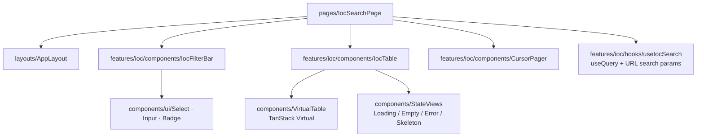

`IOC Detail`（M1）

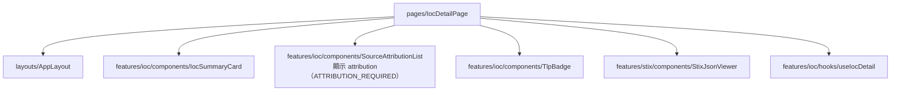

其餘頁面的元件樹於各 Phase 執行單中補齊，不在本檔窮舉。

---

*檔案結束。圖數：後端 12（1 模組 + 9 聚合 + 1 ERD + 1 sequence）、前端 5。上次校對：2026-08-21。*
